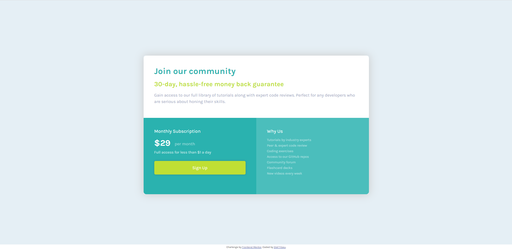

# Frontend Mentor - Single price grid component solution

This is a solution to the [Single price grid component challenge on Frontend Mentor](https://www.frontendmentor.io/challenges/single-price-grid-component-5ce41129d0ff452fec5abbbc). Frontend Mentor challenges help you improve your coding skills by building realistic projects. 

## Table of contents

- [Overview](#overview)
  - [The challenge](#the-challenge)
  - [Screenshot](#screenshot)
  - [Links](#links)
- [My process](#my-process)
  - [Built with](#built-with)
  - [Useful resources](#useful-resources)
- [Author](#author)

## Overview

### The challenge

Users should be able to:

- View the optimal layout for the component depending on their device's screen size
- See a hover state on desktop for the Sign Up call-to-action

### Screenshot

Deskop Layout

M%obile Layout

### Links

- Solution URL: https://github.com/stibau/single_price_grid
- Live Site URL: https://stibau.github.io/single_price_grid/

## My process

### Built with

- Semantic HTML5 markup
- CSS custom properties
- Flexbox
- Mobile-first workflow

### Useful resources

- [css button generator](https://css3buttongenerator.com/)
- [Good flexbox tutorial](https://css-tricks.com/snippets/css/a-guide-to-flexbox)
- [Google fonts](https://fonts.google.com/)

## Author

- Frontend Mentor - https://www.frontendmentor.io/profile/stibau
